# ｽﾀｯｸﾁｬﾝ

<!-- _class: lead -->

TypeScriptで作る<br>オープンソースロボット

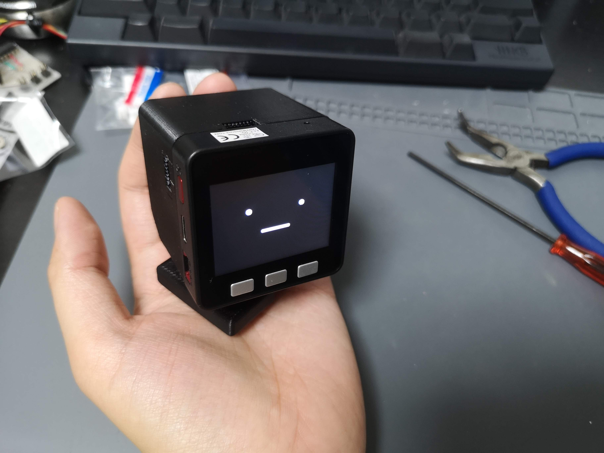

---

## ゴール

- ｽﾀｯｸﾁｬﾝとオープンソースハードウェアについて知ってもらう
- 「TypeScriptで組み込み開発」の世界を身近に感じてもらう

---

## 自己紹介

- ししかわ @meganetaaan
  * Twitterのアカウントを永久凍結されている
  * ｽﾀｯｸﾁｬﾝを作っている
* ｽﾀｯｸﾁｬﾝ [@stack_chan](https://twitter.com/stack_chan)

---

<!-- _class: lead -->

## 【前編】ｽﾀｯｸﾁｬﾝって何？

---

## ｽﾀｯｸﾁｬﾝ

- 「コミュニケーションロボットをあなたの手に」
- https://github.com/stack-chan/stack-chan


<!--
はじめまして！これはｽﾀｯｸﾁｬﾝです。
ｽﾀｯｸﾁｬﾝはオープンソースで手乗りサイズのカワイイロボットです。
キャッチフレーズは「コミュニケーションロボットを、あなたの手に。
Stack-chanの名前の由来は、IoT開発モジュールのM5Stackに、日本語で小さい子供を呼ぶときの敬称である「ちゃん」を足したものです。
親しみをこめて半角カナで表現しています。
-->

---

### ｽﾀｯｸﾁｬﾝの機能

<style scoped>
  ul {
    font-size: 0.8em;
  }
</style>

- 表情
- 首振り
- 対話
- 音声合成
- 音声認識（開発中）
- 顔認識 (開発中)

基本機能の上にユーザアプリケーション（mod）をインストール。
ユーザが自由にふるまいをプログラミングできる。


<!--
ｽﾀｯｸﾁｬﾝはコミュニケーションロボットの基本的な機能を提供していて、
これらの機能をベースにユーザ自身が自分でアプリケーションを構築していけます。
-->

---

### DEMO

<!-- _class: lead -->

---

### AIｽﾀｯｸﾁｬﾝ

<iframe width="800" height="500" src="https://www.youtube.com/embed/6lO3xe_12So?si=xoEuPlS9BXM_HPNp" title="YouTube video player" frameborder="0" allow="accelerometer; autoplay; clipboard-write; encrypted-media; gyroscope; picture-in-picture; web-share" referrerpolicy="strict-origin-when-cross-origin" allowfullscreen></iframe>

---

### AIｽﾀｯｸﾁｬﾝ ... 😮‍💨

<iframe width="400" height="500" src="https://www.youtube.com/embed/dmsD9_qfeu0" title="Claude3 Opus made Stack-chan a cynic😮‍💨" frameborder="0" allow="accelerometer; autoplay; clipboard-write; encrypted-media; gyroscope; picture-in-picture; web-share" referrerpolicy="strict-origin-when-cross-origin" allowfullscreen></iframe>

---

### Motivation

<style>
  .masked-element {
    background-color: var(--color-foreground); /* 黄色い線色 */
    mask-size: contain;
    mask-repeat: no-repeat;
    mask-mode: alpha;
  }
</style>

<style scoped>
  .closed-robot1 {
    width: 100%;
    height: 80%;
    mask-image: url('assets/images/closed_robot1.png');
  }
</style>

クローズドなロボット...内部のプログラムやバックエンドが非公開
<div class="masked-element closed-robot1"></div>

---

### Motivation

<style scoped>
  .closed-robot2 {
    width: 100%;
    height: 80%;
    mask-image: url('assets/images/closed_robot2.png');
  }
</style>

クローズドなロボットは、サービス終了とともにコミュニケーション能力を失う
<div class="masked-element closed-robot2"></div>

---

### Motivation

<style scoped>
  .why-closed {
    width: 100%;
    height: 80%;
    mask-image: url('assets/images/why_closed.png');
  }
</style>

自分のロボットと永く暮らすには？
▷自分でメンテできるように全て公開してしまえばいい！
<div class="masked-element why-closed"></div>

---

### Motivation

<style scoped>
  .container {
    display: flex;
    height: 500px;
    gap: 30px;
    flex-direction: row;
    justify-content: center;
    align-items: center;
  }
  .closed {
    width: 500px;
    height: 300px;
    mask-image: url('assets/images/closed_robot.png');
  }
  .open {
    width: 500px;
    height: 300px;
    mask-image: url('assets/images/open_robot.png');
  }
</style>
「誰もがユーザであり、同時に開発者でもある」

<div class="container">
  <div class="masked-element closed"></div>
  <div>👉</div>
  <div class="masked-element open"></div>
</div>

---

### ｽﾀｯｸﾁｬﾝの特徴「すべてがオープン」

- オープンな仕様
- オープンなプロセス
- オープンなコミュニティ

---

### オープンな仕様

<style scoped>
  ul {
    font-size: 0.8em;
  }
  .container {
    position: relative;
  }
  .apache {
    position: absolute;
    top: -320px;
    left: 640px;
    width: 500px;
    height: 240px;
    mask-image: url('assets/images/apache.png');
  }
  .resource {
    display: inline;
    height:300px;
  }
</style>

- Apache v2.0 で公開
  - 商用、非商用問わず利用可能
  - 改造＆キット化して販売する人も
- オープンソースハードウェア協会（OSHWA）の認定を取得

<div class="container">
  <div class="masked-element apache"></div>
</div>

<p>
</img>
</img>
</img>
</p>

<!-- ※厳密にいうと回路や外装のデザインには著作権無いらしいが、製作者のオープンなスタンスを示すために付けている -->

---

### オープンなプロセス

- 製作のようすを細かく発信
  - Twitter #ｽﾀｯｸﾁｬﾝ
  - Hackaday.io
- 悩みや失敗もオープンにして敷居を下げる
  - モジャった
  - バグった
  - 基板燃えた

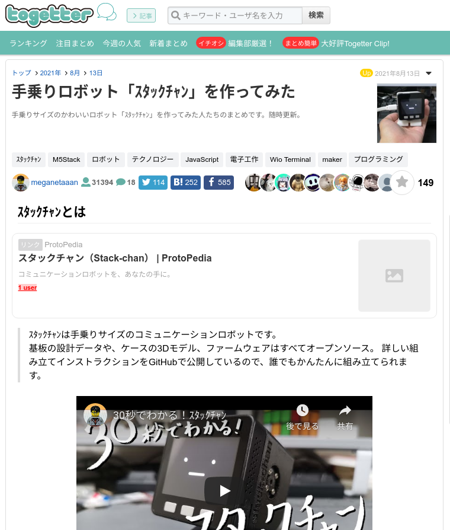

---

### オープンなコミュニティ

<style scoped>
  .container {
    position: relative;
  }
  .open-community {
    position: absolute;
    top: -380px;
    left: 640px;
    width: 500px;
    height: 480px;
    mask-image: url('assets/images/open_community.png');
  }
</style>

- 様々な界隈から「オープン」と「ｶﾜｲｲ」を共通項に大集合
  - Maker
  - ホビーロボット
  - 生成AI
  - ぬいの者
- 「AIｽﾀｯｸﾁｬﾝ」の登場でさらに拡大
- DiscordやTwitterで活発に活動中

<div class="container">
  <div class="masked-element open-community"></div>
</div>

---

### コミュニティの活動: 製作

- 作る
  - キットを購入して組み立てる
  - 公開されているデータから自作する
  - 完全自作する
- 愛でる
  - お外に連れ出す
  - イベントに出展する
- 🔍[#ｽﾀｯｸﾁｬﾝ](https://twitter.com/search?q=%23%EF%BD%BD%EF%BE%80%EF%BD%AF%EF%BD%B8%EF%BE%81%EF%BD%AC%EF%BE%9D%20OR%20%EF%BD%BD%EF%BE%80%EF%BD%AF%EF%BD%B8%EF%BE%81%EF%BD%AC%EF%BE%9D%20OR%20%23stackchan%20OR%20%22Stack-chan%22&f=media)

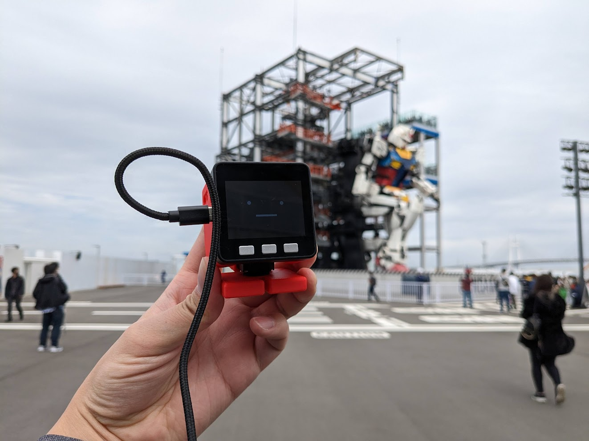

---

### コミュニティの活動: お誕生日会

- __ｽﾀｯｸﾁｬﾝの誕生日は7月2日__
- 毎年やっているｽﾀｯｸﾁｬﾝオンリーイベント
- 「お誕生日会」のコンセプトに従って楽しくお祝い
- LT大会、お祝いのビデオメッセージ、交流会、抽選会など

---

- 1歳の誕生日
- 参加者20人
- ｽﾀｯｸﾁｬﾝケーキでお祝い！

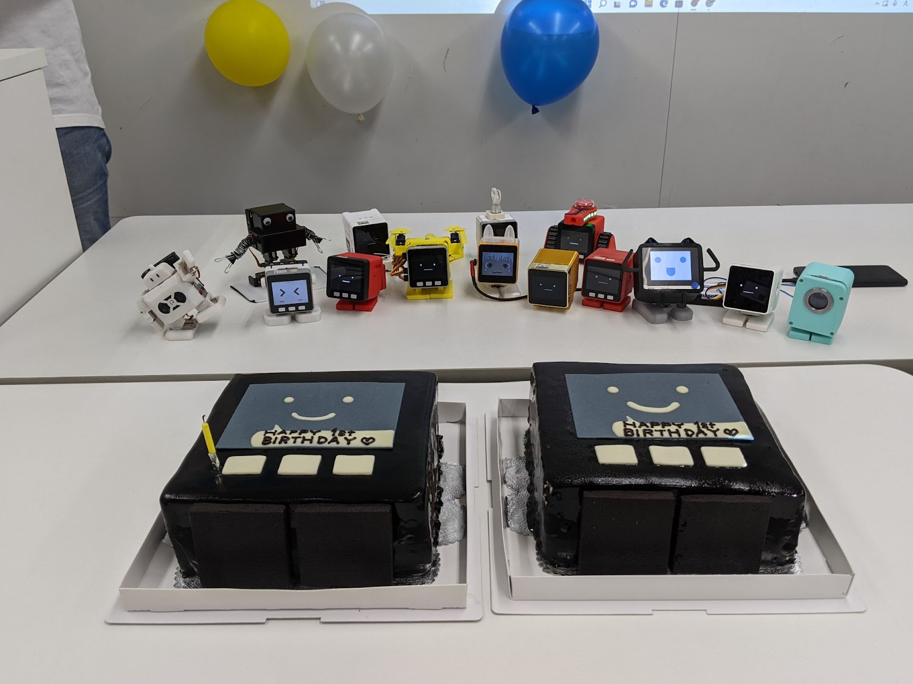

---

- 2歳の誕生日
- ⏫参加者50人
- ｽﾀｯｸﾁｬﾝピニャータを割ってお祝い！

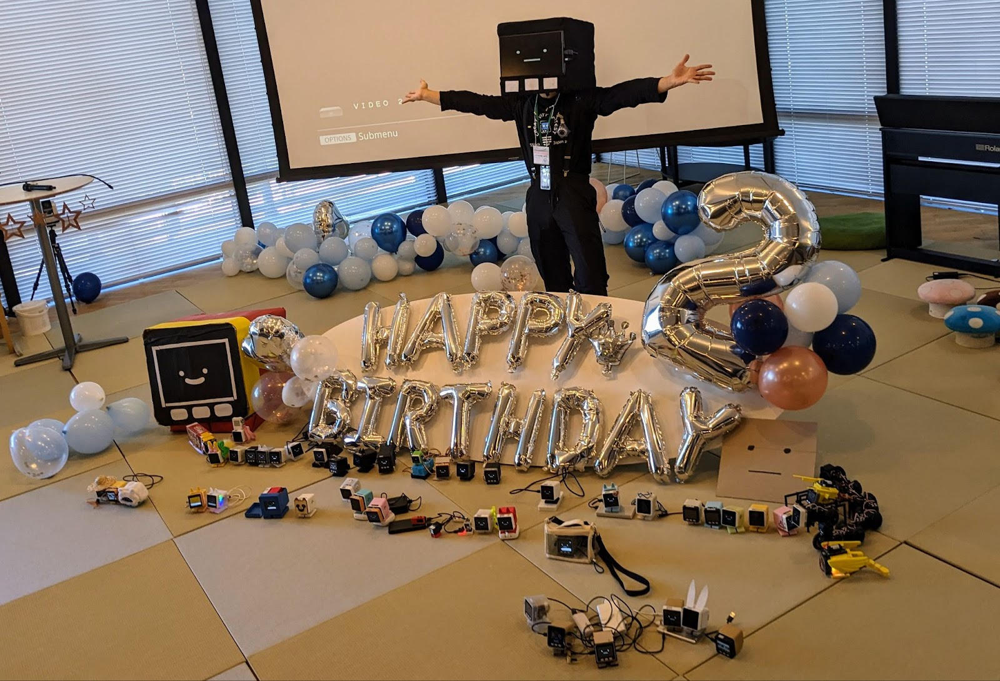

---

### コミュニティの活動: メイカー系イベント

- メイカーフェアやNT等、各種ものつくり系イベントへの出展
  - 多くのイベントはコミュニティメンバー主導
  - 計画的 < ゲリラ的

---

<style scoped>
ul {
  background-color: #000a;
  width: 60%;
  font-size: 0.8em;
}
</style>

- メイカーフェア東京
- 展示＋キット販売

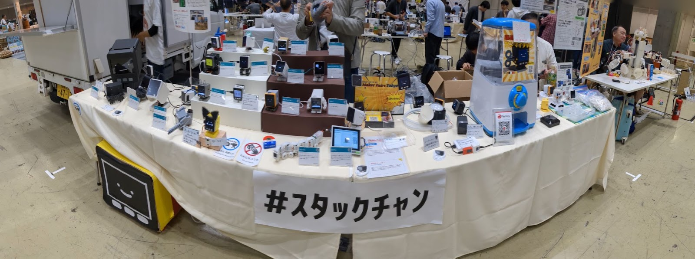

---

<style scoped>
ul {
  background-color: #000a;
  width: 60%;
  font-size: 0.8em;
}
</style>

- メイカーフェア深セン
- ししかわが皆さんの作品を預かり✈
- M5StackとNT深センのブースを間借り

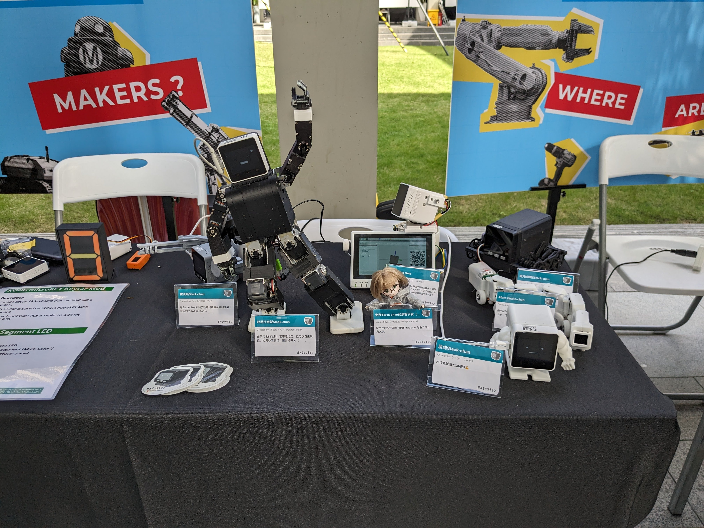
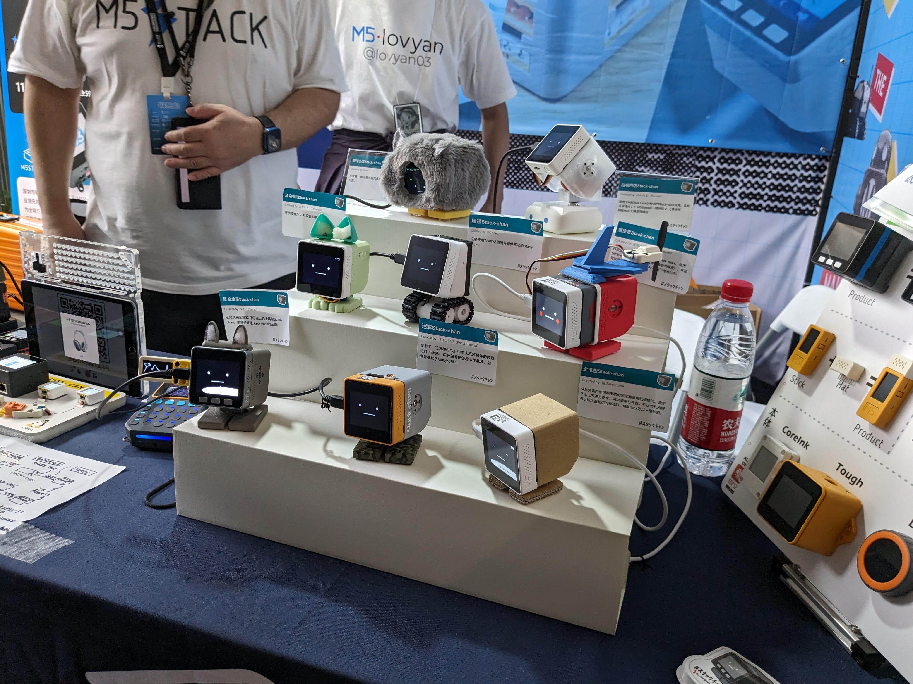

---

<!-- _class: lead -->

## 【後編】ｽﾀｯｸﾁｬﾝとTypeScript

---

### ｽﾀｯｸﾁｬﾝはTypeScriptで動く

- ｽﾀｯｸﾁｬﾝ本体で動くソースコードはほぼすべてTypeScript
  - 顔の描画
  - 音声合成
  - 対話管理（ChatGPT4やClaude3との通信）
  - モータードライバ
  - 上記機能の初期化や設定処理

- _Disclaimer: TypeScript版ｽﾀｯｸﾁｬﾝは開発途上_
  - 世に出ているｽﾀｯｸﾁｬﾝの8割はArduino(C/C++)、2割がその他(TypeScriptやUIFlow)

---

### 背景：M5Stackサイズのロボットがいたらいいなあ

- 顔だけ作っていた 
  - https://github.com/meganetaaan/m5stack-avatar/
- M5Stackをロボットの顔にして、手のひらサイズのロボットを作ろう！
- 色々な場所に連れ出したり、展示したりしたい

---

### 背景：マイコンの世界へようこそ

- 小型、軽量、低コスト
- 計算リソースが限られている
- リアルタイム処理が得意（FreeRTOSなど）
- ハードウェアプロトコル（GPIO、I2C、SPI ...）を駆使する

<style scoped>
table {
  font-size: 0.8em;
}
</style>

| 製品特性 | Raspberry Pi Zero 2 W                           | M5Stack CoreS3                                  |
|----------|------------------------------------------------|------------------------------------------|
| CPUクロック | 1GHz (クアッドコア ARM Cortex-A53)               | 最大240MHz (デュアルコア Xtensa LX7)      |
| メモリ    | 512MB RAM                                      | 512KB SRAM<br>(外部に8MB PSRAM可能)          |

<!--
ラズパイなどのシングルボードコンピュータに比べて非常に小型で、その分計算リソースが限られています。
LinuxのようなOSを搭載せずFreeRTOSなどのリアルタイムOSを搭載します。
-->

---

### 背景: Web開発者が組み込みやるときのつらみ

<style scoped>
  .wakannaiyo {
    margin-left: 300px;
    width: 100%;
    height: 80%;
    mask-image: url('assets/images/wakannaiyo.png');
  }
  ul {
    font-size: 0.7em;
  }
  .comment {
    float: left;
    font-size: 0.6em;
  }
</style>

- 組み込み始めたてのししかわ（SIerのR&DでWeb開発->ロボットベンチャー）
- C/C++のベストプラクティスと組み込み開発の知識を両方やらないといけなくて大変厳しい

<p class="comment">C/C++ 組み込み　わかんないよ！！！</p>
<div class="masked-element wakannaiyo"></div>

---

<style scoped>
  .all-js {
    width: 100%;
    height: 80%;
    mask-image: url('assets/images/all_js.png');
  }
  .ul {
    font-size: 0.8em;
  }
</style>

- 「使い慣れた言語で開発がしたい」 __「もう環境が来い」__
- Node.jsのパッケージ管理やLint、テストなどのエコシステムを流用できると尚可

<div class="masked-element all-js"></div>
<!-- 
M5Stackには機能拡張のための多彩なモジュールやユニットがありますが、その制御のコードはArduino、つまりC/C++や、MicroPythonというPythonのサブセットで提供されています。どちらにも馴染みがない場合は、言語の習得自体が物作りのハードルになります。
-->

---

### 要求をおさらい

- JavaScript(TypeScript)で開発したい
  - Webのエコシステムを活用
- 屋外や展示会で安定動作してほしい
  - ネットワーク不要
- 複数のM5Stackに対応させたい

そんな夢のようなプラットフォームが ...

---

### あった


---

### Moddable SDK


- 組み込み向けJavaScript開発プラットフォーム
- 最新のJavaScript（ECMAScript）に準拠
- マルチデバイス対応
  - M5StackシリーズやRaspberry Pi Picoなどで動作
- __TypeScriptに対応__

<!--
最新のJavaScript（ECMAScript）に対応している：ModdableのJavaScriptエンジン「xs」は最新のECMAScriptに対応しています。つまりM5Stackの中でフル機能のJavaScriptが使えます。const、letやオブジェクトの分割代入、async、awaitまで揃っています。もしWebと連携する何かをM5Stackで作りたいなら、サーバ側のコードも、M5StackのコードもすべてJavaScriptで統一することだって可能です。
-->
<!--
家電の操作画面に採用された（冷蔵庫、マッサージガン、カメラ）
-->

---

### 極小JavaScriptエンジン「XS」

- ModdableのコアとなるJavaScriptエンジン
- EcmaScriptの最新仕様に準拠
  - [test262](https://github.com/tc39/test262)の言語機能セクションの __99.41%__ をパスしている

<!-- 余談だがC言語による小さいJavaScriptエンジンの実装として参考になる。内部実装に関するドキュメントも充実している。 -->

---

<!-- _class: default -->

フル機能のJavaScript(TypeScript)がスタンドアロンで動作する

```ts
type CounterProps = {
  tick?: number;
}
class Counter {
  // プライベートフィールドと初期化子
  #tick: number;
  #count: number = 0;
  constructor(option: CounterProps = {}) {
    // オプショナルチェインとNull合体演算子
    this.#tick = option?.tick ?? 1
  }
  // getter/setter
  get count() {
    return this.#count
  }
  increment() {
    this.#count += this.#tick
  }
  decrement() {
    this.#count -= this.#tick
  }
}
```

---

### Moddable SDKの環境構築

- Node.js >= v16
- あとは`xs-dev`で一発
  - https://xs-dev.js.org/

```
npx xs-dev setup
npx xs-dev setup --device esp32
```

- 関連ツールが`$HOME/.local/share/`にインストールされる

---

### Ecma-419

- 組み込みシステム向けAPIの仕様
- https://419.ecma-international.org/
- Moddableで実装されている

---

### Ecma-419: ハードウェア

<style scoped>
  ul {
    font-size: 0.9em;
  }
</style>
- ハードウェアプロトコル
  - Digital/Analog
  - PWM
  - SPI
  - I2C
  - Serial
- ドライバ
  - Sensor
  - Display
  - RTC(Real Time Clock)

---

<!-- _class: default -->
例（`examples/io/digital`より）

```js
const Digital = device.io.Digital;
const led = new Digital({
   pin: device.pin.led,
   mode: Digital.Output,
});
led.write(1);

let state = 0;
System.setInterval(() => {
	led.write(state);
	state ^= 1;
}, 200);
```

---

### Ecma-419: ネットワーク

- ネットワークインタフェース (WiFi & Ethernet)
- TCP/UDP
- DNS
- HTTP
- MQTT
- WebSocket

---

<!-- _class: default  -->

例（`examples/io/tcp/fetch`より）

```js
import { fetch, Headers } from "fetch";
import { URLSearchParams } from "url";

const headers = new Headers([
	['Content-Type', 'application/x-www-form-urlencoded;charset=UTF-8'],
	["Date", Date()],
	["User-Agent", "ecma-419 test"]
]);
const body = new URLSearchParams([
	["Date", Date()],
	["Input", "This is no input!"]
]);

fetch("http://httpbin.org/post", { method:"POST", headers, body })
.then(response => {
	trace(`\n${response.url} ${response.status} ${response.statusText}\n\n`);
	response.headers.forEach((value, key) => trace(`${key}: ${value}\n`));
	trace("\n");
	return response.json();
})
.then(json => {
	trace(JSON.stringify(json, null, "\t"));
	trace("\n");
});
```

---

## ｽﾀｯｸﾁｬﾝ ♡ Moddable SDK


---

## ｽﾀｯｸﾁｬﾝ ♡ Moddable SDK

- __TypeScript__
- Moddableの組み込み機能
  - グラフィックス
  - サウンド
  - （性能とのトレードオフ）
- Webのエコシステム

---

### 各機能モジュールの型定義を用意

<!-- _class: default -->

```ts
/**
 * The Driver for the actuator
 */
export type Driver = {
  applyRotation: (ori: Rotation, time?: number) => Promise<void>
  getRotation: () => Promise<Maybe<Rotation>>
  setTorque: (torque: boolean) => Promise<void>
  onAttached?: () => void
  onDetached?: () => void
}

/**
 * The text-to-speech engine
 */
export type TTS = {
  stream: (text: string) => Promise<void>
  onPlayed: (volume: number) => void
  onDone: () => void
}

/**
 * The display renderer
 */
export type Renderer = {
  update: (interval: number, faceContext: Readonly<FaceContext>) => void
  addDecorator(decorator: FaceDecorator): void
  removeDecorator(decorator: FaceDecorator): void
}
```
---

### 効用①：複数の実装が型安全に書ける

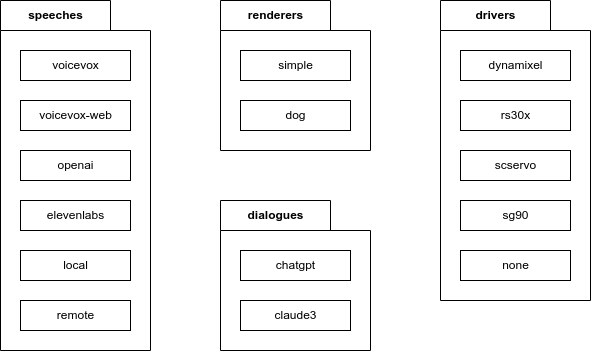

```json
{
    "config": {
        "tts": {
            "type": "voicevox"
        },
        "driver": {
            "type": "dynamixel"
        }
    }
}
```
設定で実装を切り替え

---

### 効用②：mod（ユーザアプリケーション）が型安全に書ける

<style scoped>
  .mod {
    width: 100%;
    height: 80%;
    mask-image: url('assets/images/host_and_mod.png');
  }
</style>

<div class="masked-element mod"></div>

<!--
- 基本機能の「ホスト」の上にユーザアプリケーションの「mod」を使ってもらう
  - マイクラとかPCゲームをする人には馴染み深い単語。ユーザが定義できる拡張機能。
- 音声合成、対話管理などの機能モジュールごとにインタフェースを定義して実装。設定ファイルで置き換え可能にしてある
-->

---

### さらに：Pull Requestももらえた🚀


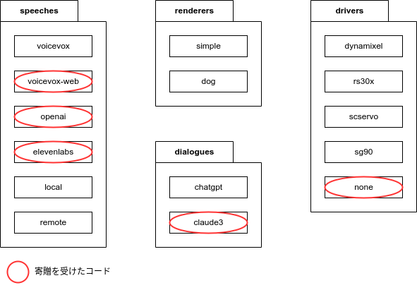

<!--
趣味のものつくり界隈だとそもそもgitでのコード管理も根付いていない場合が多く、コードの寄贈を受けるのが難しかった。
GitHubの使い方やOSSの振る舞いを心得ているWeb開発者を開発に引き込める点で効果を実感している。
-->

---

## ｽﾀｯｸﾁｬﾝ ♡ Moddable SDK

- TypeScript
- __Moddableの組み込み機能__
  - グラフィックス
  - サウンド
  - （性能とのトレードオフ）
- Webのエコシステム

---

### グラフィックス

- UIフレームワーク「piu」「commodetto」が同梱
- モダンなUI構築のための機能が全部入り
  - 文字/画像
  - __アウトライン描画__
  - タッチ入力
  - アニメーション/トランジション
  - レスポンシブ
  - コンポーネント指向

---

<table>
  <tr>
    <td>ドラッグ＆ドロップ<br></img></td>
    <td>トランジション<br></img></td>
  </tr>
  <tr>
    <td>スクロール<br></img></td>
    <td>国際化<br></img></td>
  </tr>
</table>

---

### サウンド

- 音声も機能が充実
  - オーディオ入力/出力
  - ストリーミング再生
  - 音声合成クライアント

---

### 性能とのトレードオフ

<style scoped>
  ul {
    font-size: 0.8em;
  }
</style>
- Moddableは省メモリ指向
  - xsエンジンのペナルティ
  - Moddableのモジュールは実行速度よりメモリ効率を重視
    - 細かい話だとMapの内部実装がHashMapじゃなくてListなのでランダムアクセスがO(n)
- デバッガでプロファイリングが可能
- 性能が求められる箇所は __Cで実装し、JavaScriptのコードから利用できる__
  - もちろんこのような関数に対しても型定義が用意されているし、自作も可能

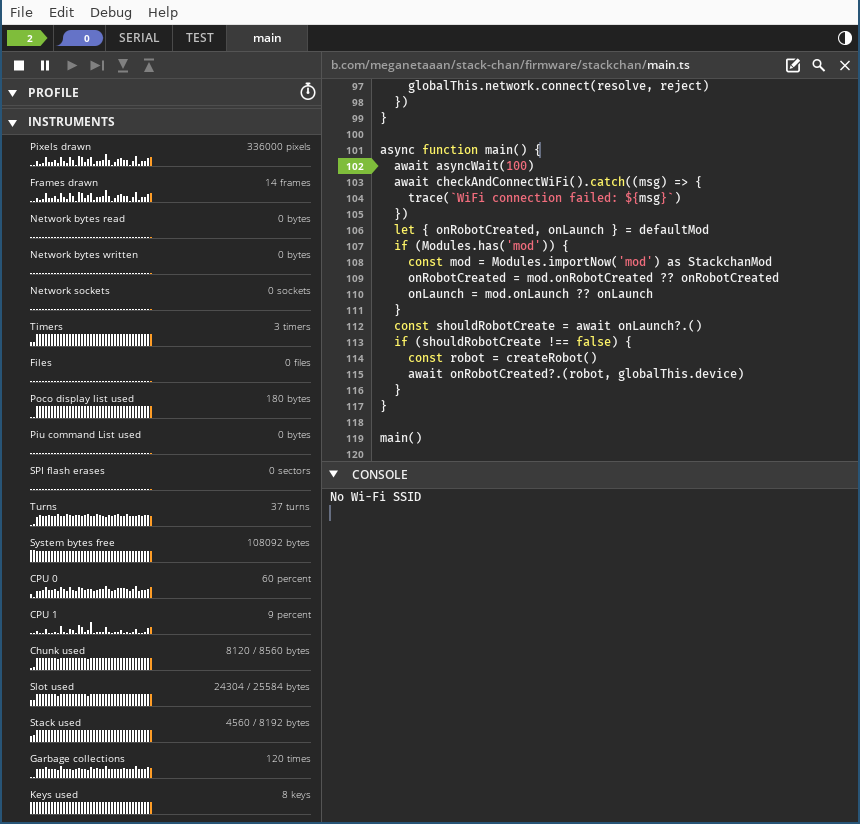

---

## ｽﾀｯｸﾁｬﾝ ♡ Moddable SDK

- TypeScript
- Moddableの組み込み機能
  - グラフィックス
  - サウンド
  - （性能とのトレードオフ）
- __Webのエコシステム__

---

### Webのエコシステムとの親和性

- ✅TypeScript
- ✅Linter/Formatter
- ⬜テスト: IOをモックした単体テストを導入予定
- その他
  - ⬜npm
  - ✅Wasm
  - ⬜Node-RED

---

### npm

- Moddableのパッケージ管理ツール `mcpack` 経由で利用可能

---

### Wasm

- Wasmビルド -> ブラウザ上で画面をプレビュー

<iframe overflow="hidden" class="left" width="420px" height="410px" src="./assets/html/render-face/index.html"></iframe>

---

### Node-RED

- ｽﾀｯｸﾁｬﾝ × ビジュアルプログラミングの可能性
- [Blockyも使える](https://github.com/phoddie/node-red-mcu/discussions/126)


---

### まとめ：ｽﾀｯｸﾁｬﾝとModdable(TypeScript)が出会ったら

- 操作性/学習性（Usability）↑↑↑
  - Web開発者がマイコンで動くアプリを開発できる
  - TypeScriptの恩恵でチーム開発も捗る
- 相互運用性↑↑
  - 異なる種類のM5Stackに対応
  - PCでデバッグ
- 性能効率（Performance Efficiency）↓
  - C APIで補う
- ワクワク感↑↑↑
  - Webのエコシステムと接続して広がる可能性！

<!--
その他
- アップデート容易性↑
- セキュリティ↑
-->

---

<!-- _class: lead -->

## 📣宣伝

---

### 🇯🇵Moddable日本語訳プロジェクト

- Moddableの130以上あるマークダウン文書を日本語訳しよう！
- OSSコントリビュートのチャンス！
- Moddableの機能群や内部実装に詳しくなれる！

https://github.com/Moddable-OpenSource/moddable-jp

---

### コミュニティに参加しよう！

* Stack-chan: https://discord.gg/HamVFhqjS9 
  - 3歳のお誕生日会 ... まもなく募集開始
  - メイカーフェア東京 ... 出展企画中

*  Moddable dev JP: https://discord.gg/7vT4Mde9u2 

---

### 参考

- [公式ドキュメント（GitHub）](https://github.com/Moddable-OpenSource/moddable-jp)
- [書籍「IoT Development for ESP32 and ESP8266 with JavaScript: A Practical Guide to XS and the Moddable SDK (English Edition)」](https://www.amazon.co.jp/dp/B08BWY2361)
- [書籍「実践Moddable」](https://www.amazon.co.jp/dp/B08HGZDCFC#customerReviews)
