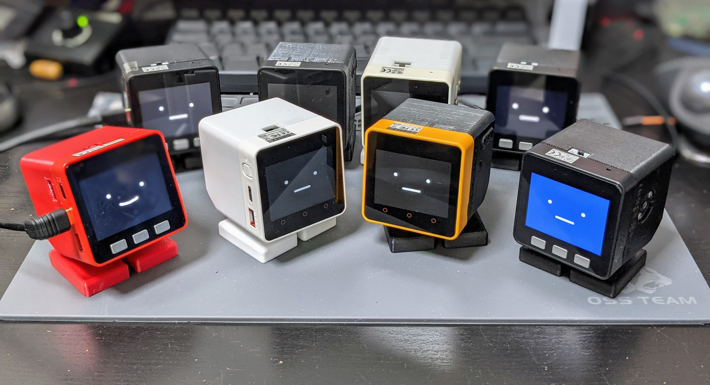
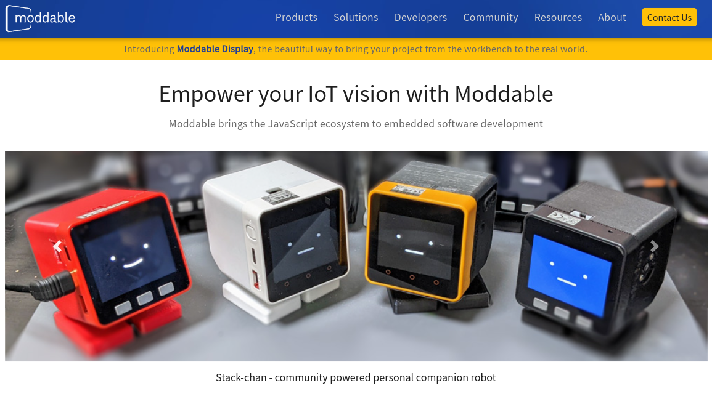

# ｽﾀｯｸﾁｬﾝ

<!-- _class: lead -->

TypeScriptで作る<br>コミュニケーションロボット


---

## 自己紹介

- ししかわ @meganetaaan
  - Twitterのアカウントを凍結されている
  - ｽﾀｯｸﾁｬﾝを作っている
- ｽﾀｯｸﾁｬﾝ [@stack_chan](https://twitter.com/stack_chan)

---

<!-- _class: lead -->

## 【前編】ｽﾀｯｸﾁｬﾝって何？

---

## ｽﾀｯｸﾁｬﾝ

- 「コミュニケーションロボットをあなたの手に」
- https://github.com/stack-chan/stack-chan



<!--
はじめまして！これはｽﾀｯｸﾁｬﾝです。
ｽﾀｯｸﾁｬﾝはオープンソースで手乗りサイズのカワイイロボットです。
キャッチフレーズは「コミュニケーションロボットを、あなたの手に。
Stack-chanの名前の由来は、IoT開発モジュールのM5Stackに、日本語で小さい子供を呼ぶときの敬称である「ちゃん」を足したものです。
親しみをこめて半角カナで表現しています。
-->

---

### ｽﾀｯｸﾁｬﾝの機能

- 表情
- 首振り
- 発話
- 対話
- 顔認識 (開発中)

<!--
ｽﾀｯｸﾁｬﾝはコミュニケーションロボットの基本的な機能を提供していて、
これらの機能をベースにユーザ自身が自分でアプリケーションを構築していけます。
-->

---

### DEMO

---

### AIｽﾀｯｸﾁｬﾝ

<iframe width="800" height="500" src="https://www.youtube.com/embed/6lO3xe_12So?si=xoEuPlS9BXM_HPNp" title="YouTube video player" frameborder="0" allow="accelerometer; autoplay; clipboard-write; encrypted-media; gyroscope; picture-in-picture; web-share" referrerpolicy="strict-origin-when-cross-origin" allowfullscreen></iframe>

---

### AIｽﾀｯｸﾁｬﾝ ... 😮‍💨

<iframe width="400" height="500" src="https://www.youtube.com/embed/dmsD9_qfeu0" title="Claude3 Opus made Stack-chan a cynic😮‍💨" frameborder="0" allow="accelerometer; autoplay; clipboard-write; encrypted-media; gyroscope; picture-in-picture; web-share" referrerpolicy="strict-origin-when-cross-origin" allowfullscreen></iframe>

---

### Motivation

<style>
  .masked-element {
    background-color: var(--color-foreground); /* 黄色い線色 */
    mask-size: contain;
    mask-repeat: no-repeat;
    mask-mode: alpha;
  }
</style>

<style scoped>
  .closed-robot1 {
    width: 100%;
    height: 80%;
    mask-image: url('assets/images/closed_robot1.png');
  }
</style>

クローズドなロボット...内部のプログラムやバックエンドが非公開
<div class="masked-element closed-robot1"></div>

---

### Motivation

<style scoped>
  .closed-robot2 {
    width: 100%;
    height: 80%;
    mask-image: url('assets/images/closed_robot2.png');
  }
</style>

クローズドなロボットは、サービス終了とともにコミュニケーション能力を失う
<div class="masked-element closed-robot2"></div>

---

### Motivation

<style scoped>
  .why-closed {
    width: 100%;
    height: 80%;
    mask-image: url('assets/images/why_closed.png');
  }
</style>

自分のロボットと永く暮らすには？
▷自分でメンテできるように全て公開してしまえばいい！
<div class="masked-element why-closed"></div>

---

### Motivation

<style scoped>
  .container {
    display: flex;
    height: 500px;
    gap: 30px;
    flex-direction: row;
    justify-content: center;
    align-items: center;
  }
  .closed {
    width: 500px;
    height: 300px;
    mask-image: url('assets/images/closed_robot.png');
  }
  .open {
    width: 500px;
    height: 300px;
    mask-image: url('assets/images/open_robot.png');
  }
</style>
「誰もがユーザであり、同時に開発者でもある」

<div class="container">
  <div class="masked-element closed"></div>
  <div>👉</div>
  <div class="masked-element open"></div>
</div>

---

### ｽﾀｯｸﾁｬﾝの特徴「すべてがオープン」

- オープンな仕様
- オープンなプロセス
- オープンなコミュニティ

---

### オープンな仕様

<style scoped>
  .apache {
    width: 500px;
    height: 300px;
    mask-image: url('assets/images/apache.png');
  }
</style>

- Apache v2.0 で公開
  - 商用、非商用問わず利用可能
  - 改造＆キット化して販売する人も
<div class="masked-element apache"></div>
<!-- ※厳密にいうと回路や外装のデザインには著作権無いらしいが、製作者のオープンなスタンスを示すために付けている -->

---

### オープンなプロセス

- 製作のようすを細かく発信
  - Twitter #ｽﾀｯｸﾁｬﾝ
  - Hackaday.io
- 悩みや失敗もオープンに
  - モジャった
  - バグった
  - 基板燃えた


---

### オープンなコミュニティ

- ｽﾀｯｸﾁｬﾝのオープンな精神に共感した開発者が集まってコミュニティを形成した
- 昨年ChatGPTと接続した「AIｽﾀｯｸﾁｬﾝ」の登場で爆発的に拡大
- DiscordやTwitterで活発に活動中

---

### コミュニティの活動: 制作

- マイｽﾀｯｸﾁｬﾝ

---

### コミュニティの活動: お誕生日会

- __ｽﾀｯｸﾁｬﾝの誕生日は7月2日__
- 毎年やっているｽﾀｯｸﾁｬﾝオンリーイベント
- 「お誕生日会」のコンセプトに従って楽しくお祝い
- LT大会、お祝いのビデオメッセージ、交流会、抽選会など

---

- 1歳の誕生日
- 参加者20人
- ｽﾀｯｸﾁｬﾝケーキでお祝い！


---

- 2歳の誕生日
- ⏫参加者50人
- ｽﾀｯｸﾁｬﾝピニャータを割ってお祝い！


---

### コミュニティの活動: メイカー系イベント

- メイカーフェアやNT等、各種ものつくり系イベントへの出展
  - 他のイベントはコミュニティメンバー主導
  - 計画的 < ゲリラ的

---

<style scoped>
ul {
  background-color: #000a;
  width: 60%;
  font-size: 0.8em;
}
</style>

- メイカーフェア東京
- 展示＋キット販売


---

<style scoped>
ul {
  background-color: #000a;
  width: 60%;
  font-size: 0.8em;
}
</style>

- メイカーフェア深セン
- ししかわが皆さんの作品を預かり✈
- M5StackとNT深センのブースを間借り


---
### ｽﾀｯｸﾁｬﾝはTypeScriptで動く

- ｽﾀｯｸﾁｬﾝ本体で動くソースコードはすべてModdable
  - 音声合成
  - 顔とemoticonの描画
  - 対話管理（ChatGPT4やClaude3に対応）
  - モータードライバ
  - 上記機能の初期化や設定処理

---

### Why: なぜTypeScriptを使おうと思った？

- 自分が必要だったから
- ししかわは元々Web開発者->ロボットベンチャー
- C/C++のベストプラクティスと組み込み開発の知識を両方やらないといけない
- マイコンのベンダが提供する独自IDE
- Node.jsのパッケージ管理やLint、テストなどのエコシステムを流用したい
- 「Webの言語を使ってロボットを制御したい」

<!-- 
M5Stackには機能拡張のための多彩なモジュールやユニットがありますが、その制御のコードはArduino、つまりC/C++や、MicroPythonというPythonのサブセットで提供されています。どちらにも馴染みがない場合は、言語の習得自体が物作りのハードルになります。
-->

---

### 使い方

- 基本機能の「ホスト」の上にユーザアプリケーションの「mod」を使ってもらう
  - マイクラとかPCゲームをする人には馴染み深い単語。ユーザが定義できる拡張機能。
- 音声合成、対話管理などの機能モジュールごとにインタフェースを定義して実装。設定ファイルで置き換え可能にしてある

---

### Disclaimer: Moddable版ｽﾀｯｸﾁｬﾝは開発途上

- Arduinoが8割、Moddableが2割程度

---

<!-- _class: lead -->

## 【後編】ModdableとEcma-419

---

### マイコンの世界

- 小型、軽量、低コスト
- 計算リソースが限られている
- リアルタイム処理が得意（FreeRTOSなど）

<style scoped>
table {
  font-size: 0.8em;
}
</style>

| 製品特性 | Raspberry Pi Zero 2 W                           | M5Stack CoreS3                                  |
|----------|------------------------------------------------|------------------------------------------|
| CPUクロック | 1GHz (クアッドコア ARM Cortex-A53)               | 最大240MHz (デュアルコア Xtensa LX7)      |
| メモリ    | 512MB RAM                                      | 512KB SRAM<br>(外部に8MB PSRAM可能)          |

<!--
ラズパイなどのシングルボードコンピュータに比べて非常に小型で、その分計算リソースが限られています。
LinuxのようなOSを搭載せずFreeRTOSなどのリアルタイムOSを搭載します。
-->
---

### Moddable SDK


- 組み込み向けJavaScript開発プラットフォーム
- 最新のJavaScript（ECMAScript）に準拠
- マルチデバイス対応
  - M5StackシリーズやRaspberry Pi Picoなどで動作
- __TypeScriptに対応__

<!--
最新のJavaScript（ECMAScript）に対応している：ModdableのJavaScriptエンジン「xs」は最新のECMAScriptに対応しています。つまりM5Stackの中でフル機能のJavaScriptが使えます。const、letやオブジェクトの分割代入、async、awaitまで揃っています。もしWebと連携する何かをM5Stackで作りたいなら、サーバ側のコードも、M5StackのコードもすべてJavaScriptで統一することだって可能です。
-->
<!--
家電の操作画面に採用された（冷蔵庫、マッサージガン、カメラ）
-->

---

### 極小JavaScriptエンジン「XS」

- ModdableのコアとなるJavaScriptエンジン
- EcmaScriptの最新仕様に準拠
  - [test262](https://github.com/tc39/test262)の言語機能セクションの __99.41%__ をパスしている

<!-- 余談だがC言語による小さいJavaScriptエンジンの実装として参考になる。内部実装に関するドキュメントも充実している。 -->

---

フル機能のJavaScript(TypeScript)がスタンドアロンで動作する

```ts
type CounterProps = {
  tick?: number;
}
class Counter {
  // プライベートフィールドと初期化子
  #tick: number;
  #count: number = 0;
  constructor(option: CounterProps = {}) {
    // オプショナルチェインとNull合体演算子
    this.#tick = option?.tick ?? 1
  }
  // getter/setter
  get count() {
    return this.#count
  }
  increment() {
    this.#count += this.#tick
  }
  decrement() {
    this.#count -= this.#tick
  }
}
```

---

### Moddable SDKの環境構築

- Node.js >= v16
- あとは`xs-dev`で一発
  - https://xs-dev.js.org/

```
npx xs-dev setup
npx xs-dev setup --device esp32
```

- 関連ツールが`$HOME/.local/share/`にインストールされる

---

### Ecma-419

- 組み込みシステム向けAPIの仕様
- https://419.ecma-international.org/
- Moddableで実装されている

---

### Ecma-419: ハードウェア

- ハードウェアプロトコル
  - Digital/Analog
  - PWM
  - SPI
  - I2C
  - Serial
- ドライバ
  - Sensor
  - Display
  - RTC(Real Time Clock)

---

<!-- _class: -->
例（`examples/io/digital`より）

```js
const Digital = device.io.Digital;
const led = new Digital({
   pin: device.pin.led,
   mode: Digital.Output,
});
led.write(1);

let state = 0;
System.setInterval(() => {
	led.write(state);
	state ^= 1;
}, 200);
```

---

### Ecma-419: ネットワーク

- ネットワークインタフェース (WiFi & Ethernet)
- TCP/UDP
- DNS
- HTTP
- MQTT
- WebSocket

---

<!-- _class:  -->

例（`examples/io/tcp/fetch`より）

```js
import { fetch, Headers } from "fetch";
import { URLSearchParams } from "url";

const headers = new Headers([
	['Content-Type', 'application/x-www-form-urlencoded;charset=UTF-8'],
	["Date", Date()],
	["User-Agent", "ecma-419 test"]
]);
const body = new URLSearchParams([
	["Date", Date()],
	["Input", "This is no input!"]
]);

fetch("http://httpbin.org/post", { method:"POST", headers, body })
.then(response => {
	trace(`\n${response.url} ${response.status} ${response.statusText}\n\n`);
	response.headers.forEach((value, key) => trace(`${key}: ${value}\n`));
	trace("\n");
	return response.json();
})
.then(json => {
	trace(JSON.stringify(json, null, "\t"));
	trace("\n");
});
```

---

### UIフレームワーク「piu」「commodetto」

- Moddableに同梱のUIフレームワーク
- モダンなUI構築のための機能が全部入り
  - ✅ 文字/画像
  - ✅ __アウトライン描画__
  - ✅ サウンド
  - ✅ タッチ入力
  - ✅ アニメーション/トランジション
  - ✅ レスポンシブ
  - ✅ コンポーネント指向

---

<table>
  <tr>
    <td>ドラッグ＆ドロップ<br></img></td>
    <td>トランジション<br></img></td>
  </tr>
  <tr>
    <td>スクロール<br></img></td>
    <td>国際化<br></img></td>
  </tr>
</table>

---

### 性能とのトレードオフ

- Moddableは省メモリ指向
- 細かい話だとMapの内部実装がHashMapじゃなくてListなのでランダムアクセスがO(n)
- 性能が求められる箇所は __Cで実装し、JavaScriptのコードから利用できる__
  - もちろんこのような関数に対しても型定義が用意されているし、自作も可能

---

## ｽﾀｯｸﾁｬﾝ ♥ Moddable SDK



---

### 各機能モジュールの型定義を用意

---

### PRもらえた！

---

### Webのエコシステムとの親和性

- TypeScript: ｽﾀｯｸﾁｬﾝのホストプログラムに適用済み
  - anyはあります
- ESLintとPrettier: （CI含め）使っている
- テスト: 使えるはず
- その他
  - ビジュアルプログラミングプラットフォームのNode-REDでModdableのコードを生成できる！

---

### npm

- Moddableのパッケージ管理ツール `mcpack` 経由で利用可能

---

### Linter/Formatter

---

### Wasm

- Wasmビルド -> ブラウザ上で画面をプレビュー

<iframe overflow="hidden" class="left" width="420px" height="410px" src="./assets/html/render-face/index.html"></iframe>

---

### Node-RED

---

### まとめ：Moddableを使うとどうなるか

- 操作性/学習性（Usability）↑↑↑
  - Web開発者がマイコンで動くアプリを開発できる
- 互換性↑↑
  - 異なる種類のマイコンに対応
- アップデート容易性↑
- セキュリティ↑
- 性能効率（Performance Efficiency）↓
  - C APIで補う

---

## おわりに

### ミュニティに参加しよう！

- ｽﾀｯｸﾁｬﾝとModdableを中心に様々な活動をしている
  - ｽﾀｯｸﾁｬﾝコミュニティ
    - 3歳のお誕生日会の募集もうすぐ
    - メイカーフェア東京に出展企画中
    - Moddable版試してみてね！
  - Moddable日本開発者コミュニティ
    - Discordでワイワイ

---

### Discord

-  Stack-chan: https://discord.gg/HamVFhqjS9 
-  Moddable dev JP: https://discord.gg/7vT4Mde9u2

---

### 参考

- 公式ドキュメント（GitHub）
- 書籍「IoT Development for ESP32 and ESP8266 with JavaScript: A Practical Guide to XS and the Moddable SDK (English Edition)」
- 書籍「実践Moddable」
